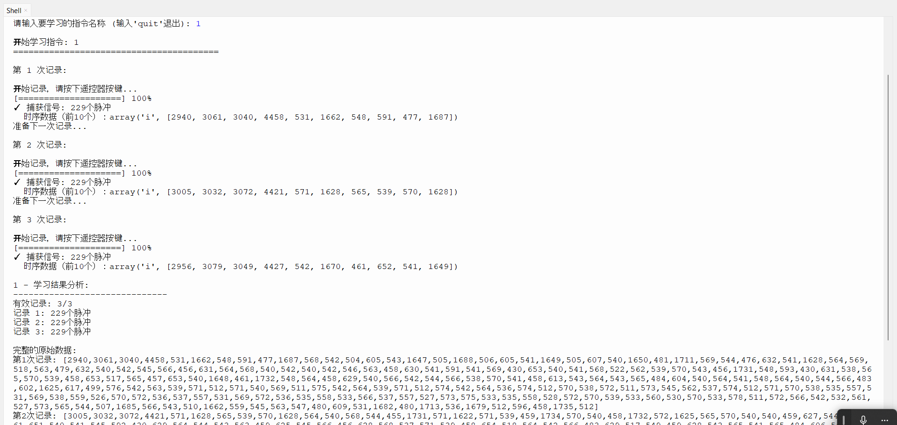
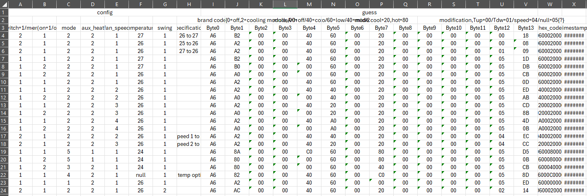

# Haier-AC-IR-controller-using-esp32/海尔空调红外物联网控制器

## Adding an extra infrared module to old air conditioners to realize IoT/旧空调加装红外模块实现物联网


## 背景
我的老式空调只有红外遥控功能，无物联网功能。
通过此设备，我希望实现智能化控制，例如每晚11:00自动设为25°C，3:00调整为27°C等。
该设备配有屏幕显示任务状态，支持Wi-Fi连接，可设置和修改任务计划。


## 个人实力
- esp32相关：不懂
- python：略有了解
- micropython：不懂
- 通信相关：不懂
- github交互：不曾

~~综合实力：取决于AI~~


## 探索过程概述
- 无头苍蝇
  - 我将[背景](README.md#背景)部分输入gemini2.5pro，得到指导，上某宝购买了一些零件
  - 我将买到的零件列表（包括参数）输入2.5pro。他给出了硬件连接建议，并建议我使用ArduinoIDE。
  - 学习烧录程序，每次都要按着板子上的boot按钮，很不方便。运行程序要按EN按钮
  - 开启“grounding with google”以后，2.5pro 持续给我输出已经404的红外指令库，让我很苦恼
  - 我要求不再使用Arduino，以避免相关红外库。2.5pro建议使用Thonny 和 micropython。这样只需要在第一次烧录一个解释器，后续在电脑终端控制即可。

- 稍有头绪
  - 由于2.5pro令我不满，我转而使用sonnet3.7。重新配置了硬件连接，并获得了切实可行代码 _（claude确实好用）_
  - 红外接收器接收到遥控器信号，但是发射该信号时空调没反应
  - 意识到可能是程序缺陷，没有学习到完整的红外信号
  - 尝试获得完整的红外信号
  - 转而尝试解码红外信号（需要了解其结构，仅仅学习信号并模拟输出可能无效）
- 有所发现

  - 获得完整，稳定的脉冲信号
  - 尝试理解。把获得的hex码发给gpt-o3，经过指点，得知：
    - 不同的脉冲长度可能代表：帧头，0，1 ······
  - 尝试并实现：
    - 把数值转换为散点图和折线图（方便找到0/1/包头，辨别噪音）
    - 实现通用脚本，把脉冲信号转换成16进制数
    - 把脚本移植到micropython环境，实现端侧解码一条龙
- 深入探索

  - 收集不同的信号并解码，尝试翻译。（方便以后自己制造信号）

······工作中······

## 细节实现与代码
### 配置硬件
#### 首先连接硬件
参见[硬件清单](Hardware%20Check/hardware%20list.md)和[硬件连接](Hardware%20Check/Hardware%20Hookup.py)
#### 检查功能
电脑上用Thonny在esp32上烧录好micropython环境后，运行硬件检测程序。
分别检查[屏幕](Hardware%20Check/screen%20test.py),[红外接收器](Hardware%20Check/IR_Receiver.py)。其中屏幕需要[sh1106驱动](Hardware%20Check/sh1106.py)

红外发射器模块，指示灯可亮，但是实际上空调没反应，不知道哪里出了问题。
### 解码红外信号

以下为探索过程，可忽略
> #### 获得脉冲信号
> 接下来尝试获得红外信号。使用[这个](IR%20learn/IR_learn.py)脚本，同一信号对接收器发射三次，程序会给出三次的脉冲信号。
> _单次学习可容纳999次脉冲，这是考虑到：有些遥控器（电视机）可以连发同一信号，来提升成功率。（但是我的空调遥控器只会发送一次）_
>
> 脚本效果如图
> 
>
> 现在我对 27°/26°+开/关 共四种信号分别学习了6次，得到[原始的脉冲信号](IR%20learn/rawdata)。
>
>  _文件夹里的[blank file gen](IR%20learn/rawdata/blank%20file%20gen.py)是我调试时，用于生成一堆文件名带有参数的txt空文件。_
>
> _最内层文件夹里的[decode.py](IR%20learn/rawdata/27pwon/decode.py)是我调试后期做的解码脚本，后面会提到。_
>
> #### 解码脉冲信号
> 现在，我了解到，脉冲里的"n,n,···，n,n" 代表 "有信号时间，无信号时间，······有信号时间，无信号时间"。这些脉冲时间两两一组，可能代表不同含义。比如下表：
>
> <table border="1" cellspacing="0" cellpadding="5" style="text-align: center; border-collapse: collapse; font-family: sans-serif;">
>   <tbody>
>     <tr>
>       <th style="text-align: left; background-color: #f2f2f2;">pulse</th>
>       <td>2946</td>
>       <td>3056</td>
>       <td>3074</td>
>       <td>4423</td>
>       <td>550</td>
>       <td>1647</td>
>       <td>544</td>
>       <td>565</td>
>       <td>545</td>
>       <td>1649</td>
>       <td>544</td>
>       <td>561</td>
>       <td>573</td>
>       <td>539</td>
>       <td>470</td>
>       <td>1719</td>
>       <td>546</td>
>       <td>1648</td>
>       <td>570</td>
>       <td>526</td>
>       <td>474</td>
>       <td>1732</td>
>       <td>569</td>
>       <td>543</td>
>       <td>476</td>
>       <td>1714</td>
>       <td>542</td>
>       <td>570</td>
>     </tr>
>     <tr>
>       <th style="text-align: left; background-color: #f2f2f2;">signal</th>
>       <td>yse</td>
>       <td>no</td>
>       <td>yes</td>
>       <td>no</td>
>       <td>yse</td>
>       <td>no</td>
>       <td>yes</td>
>       <td>no</td>
>       <td>yes</td>
>       <td>no</td>
>       <td colspan="18">&...</td>
>     </tr>
>     <tr>
>       <th style="text-align: left; background-color: #f2f2f2;">grouping</th>
>       <td colspan="2">Two by two</td>
>       <td colspan="2">Two by two</td>
>       <td colspan="2">Two by two</td>
>       <td colspan="2">Two by two</td>
>       <td colspan="2">Two by two</td>
>       <td colspan="18">&...</td>
>     </tr>
>     <tr>
>       <th style="text-align: left; background-color: #f2f2f2;">unit time(T=500)</th>
>       <td>6</td>
>       <td>6</td>
>       <td>6</td>
>       <td>9</td>
>       <td>1</td>
>       <td>3</td>
>       <td>1</td>
>       <td>1</td>
>       <td>1</td>
>       <td>3</td>
>       <td>1</td>
>       <td>1</td>
>       <td>1</td>
>       <td>1</td>
>       <td>1</td>
>       <td>3</td>
>       <td>1</td>
>       <td>3</td>
>       <td>1</td>
>       <td>1</td>
>       <td>1</td>
>       <td>3</td>
>       <td>1</td>
>       <td>1</td>
>       <td>1</td>
>       <td>3</td>
>       <td>1</td>
>       <td>1</td>
>     </tr>
>     <tr>
>       <th style="text-align: left; background-color: #f2f2f2;">Binary meaning</th>
>       <td colspan="4">header</td>
>       <td colspan="2">1</td>
>       <td colspan="2">0</td>
>       <td colspan="2">1</td>
>       <td colspan="2">0</td>
>       <td colspan="2">0</td>
>       <td colspan="2">1</td>
>       <td colspan="2">1</td>
>       <td colspan="2">0</td>
>       <td colspan="2">1</td>
>       <td colspan="6">&...</td>
>     </tr>
>   </tbody>
> </table>
>
> 如果能把时间作为y轴，信号数作为x轴，画一个折线图，就可以更直观地看出每组信号代表的含义。于是，我做了[这个](I%20learn/attemp%20decode/graph.ipynb)脚本，用于画图，比如：[这](IR%20learn/attemp%20decode/26pwoff.png)是26°关机的脉冲图。
>
> 
>
> 仔细端详图片，我认为开头那4个3000+的是包头 _(用于和空调握手)_，不用管。后面数据里的1500-1900的代表1，400到700的代表0。
>
> 由于器械测量有误差，有一些反常数值，应该抛弃。
>
> 最终，[这个程序](IR%20learn/attemp%20decode/decode.py)可以读取同一指令的不同红外信号，经过对比，得出最合理（共识）的二进制代码，再得到16进制代码。
>
> 当然，这个ipynb脚本用于调试，还有一键解码的[完整python脚本](IR%20learn/attemp%20decode/decode.py)，也就是上文提到的decode.py，运行结果就像[这样](IR%20learn/attemp%20decode/result)。
> ```
> .
> .
> .
> 
> --- 步骤 5: 最终转换和输出 ---
> 最终共识二进制字符串: 1010011010100000000000000000000000000000011000000000000000100000000000000000000000000000000000000000010111001011
> 共识字符串中的总位数: 112
> 十进制结果: 3,379,556,500,210,230,480,828,486,117,230,027
> 十六进制结果: A6A0 0000 0060 0020 0000 0000 05CB
> 
> --- 处理完成 ---
>```
> 
> 但是，这个解码脚本引入了一些像panda的库，不适用于micropython。另外他还需要手动导入脉冲信号，使用不方便。

现在，我做了[一条龙脚本](one_dragon/opt_specification.py)，在esp32上运行，实现以下功能：
- 用户输入模式参数。 终端提示开始学习，显示时间进度，用户发射信号。
- esp对同一信号学习6次，得到6组信号。
- 终端提示开始解码，esp解码，仅输出16进制，相关数据生成csv保存在esp根目录。
- 无法解出提示报错

最后我获得了[数据](one_dragon/cut-hex-room/more%20code.csv)
> 这个[脚本](one_dragon/cut-hex-room/cut-hex.py)用于切割字节

下方这个图片附上了我的猜测，详细信息移步[表格](guess.csv)。



······施工中······

## 希望探讨的问题
目前我卡在两个地方
1. 红外码的翻译，详见我收集的[信号列表](one_dragon/cut-hex-room/more%20code.csv)
2. 红外发射器发射信号，空调无反应

以及其他和项目有关的话题

## TODO List

- [x] 硬件搭建
- [x] 屏幕可用
- [x] 红外接收器可用
- [ ] 红外发射器可用
- [x] 接收遥控器信号，得到raw data
- [ ] 模拟并发射遥控器信号，空调响应
- [x] 实现端侧一条龙解码脚本
- [ ] 实现红外指令破译
- [ ] 无电脑辅助，独自学习红外信号
- [ ] 实现局域网控制（sd存储）
······额外······
- [ ] 实现搞笑音效（喇叭）
- [ ] 实现语音指令（麦克风）

## 贡献方式
虚心求教，欢迎各类与项目相关的批评，渴望大神指点

欢迎大家提出建议、反馈或提交 Pull Request。

## 许可证
本项目采用 Apache-2.0协议
